# 🌍 EcoRewards: Turning Waste into Value

<div align="center">


### 🎉 Winner - GeeksForGeeks Hackathon @SRM AP University 🎉

*Rewarding Responsibility, One Deposit at a Time*

[](https://eco-rewards-wheat.vercel.app)
[](https://github.com/Ojasvvv/Eco-rewards)
[](mailto:teamapatheia@gmail.com)

</div>

---

## 📖 Table of Contents

- [🎯 About](#-about)
- [🚨 The Problem](#-the-problem-were-solving)
- [💡 Our Solution](#-our-solution)
- [✨ Key Features](#-key-features)
- [🛠️ Tech Stack](#️-tech-stack)
- [🔒 Security Features](#-security-features)
- [🏗️ Architecture](#️-architecture)
- [📸 Screenshots](#-screenshots)
- [🔮 Future Roadmap](#-future-roadmap)
- [👥 Team](#-team)
- [💻 Development](#-development--technical-leadership)
- [📞 Contact](#-contact--links)

---

## 🎯 About

**EcoRewards** is a gamified waste management platform that transforms responsible waste disposal into a rewarding experience. Users earn points and discount coupons from local businesses for every proper waste deposit.

<div align="center">

### 🏆 Achievement
**Winner** of the **GeeksForGeeks Hackathon** at **SRM AP University**  
*Recognized for innovative approach to environmental sustainability and robust technical implementation*

</div>

### 📱 What We Built

<div align="center">

<table>
<tr>
<td width="20%" align="center">

<br><strong>Secure Auth</strong>
<br><sub>User management</sub>
</td>
<td width="20%" align="center">

<br><strong>Real-time Rewards</strong>
<br><sub>Gamification system</sub>
</td>
<td width="20%" align="center">

<br><strong>Location Based</strong>
<br><sub>GPS validation</sub>
</td>
<td width="20%" align="center">

<br><strong>Leaderboards</strong>
<br><sub>City-wide rankings</sub>
</td>
<td width="20%" align="center">

<br><strong>Comprehensive Security</strong>
<br><sub>Top-grade protection</sub>
</td>
</tr>
</table>

</div>

> **Hardware Integration:** The smart dustbin hardware (sensors, IoT modules) is currently under development and will be integrated in future phases.

---

## 🚨 The Problem We're Solving

<table>
<tr>
<td width="33%" align="center">

### 🌍 Massive Waste Crisis
**1.3 billion tons** of waste generated annually, overwhelming ecosystems worldwide

</td>
<td width="33%" align="center">

### 😴 Public Apathy
Current systems offer **no engagement** or feedback, leading to poor disposal habits

</td>
<td width="33%" align="center">

### 🚫 Zero Incentive
Widespread littering due to **lack of motivation** for proper waste disposal

</td>
</tr>
</table>

---

## 💡 Our Solution

<div align="center">

### The Concept
Transform waste disposal from a chore into an **engaging, rewarding experience**

</div>

### 📱 User Flow Diagram

```mermaid
graph LR
    A[🔐 Sign In<br/>Google] --> B[🔢 Enter Code<br/>Location Verified]
    B --> C[🗑️ Bin Opens<br/>10 seconds]
    C --> D[✅ Trash Checked<br/>Sensors]
    D --> E[🎁 Get Reward<br/>Instant]
    
    style A fill:#4CAF50,stroke:#2E7D32,stroke-width:3px,color:#000
    style B fill:#2196F3,stroke:#1565C0,stroke-width:3px,color:#000
    style C fill:#FF9800,stroke:#E65100,stroke-width:3px,color:#000
    style D fill:#9C27B0,stroke:#6A1B9A,stroke-width:3px,color:#fff
    style E fill:#F44336,stroke:#C62828,stroke-width:3px,color:#fff
```

<div align="center">



**How It Works:**
1. 🔐 Sign in with Google
2. 🔢 Enter dustbin code (location verified automatically)
3. 🗑️ Smart bin opens for 10 seconds
4. ✅ Sensors check if trash was deposited
5. 🎁 Receive instant rewards!

</div>

### 🎯 Core Features

<div align="center">

| 🎮 **Gamification** | 🎁 **Instant Rewards** | 📊 **Impact Tracking** | 🏆 **Community** |
|:---:|:---:|:---:|:---:|
| Points, achievements,<br>and leaderboards | Real discount coupons<br>from local businesses | Visualize your<br>environmental contribution | City-wide rankings<br>and challenges |

</div>

### 💰 Business Model - Win³ Ecosystem

<div align="center">

<table>
<tr>
<td width="25%" align="center">
<h3>📺 Ad Display</h3>
<p>Companies sponsor<br>bin displays</p>
</td>
<td width="25%" align="center">
<h3>📊 Data Insights</h3>
<p>Analytics for<br>municipalities</p>
</td>
<td width="25%" align="center">
<h3>🏪 Local Partnerships</h3>
<p>Businesses give<br>coupons</p>
</td>
<td width="25%" align="center">
<h3>♻️ Waste Sale</h3>
<p>Recycling<br>revenue</p>
</td>
</tr>
</table>

**Result:**

<table>
<tr>
<td align="center" width="33%">
✅ Users keep cities clean<br>and earn rewards
</td>
<td align="center" width="33%">
✅ Businesses gain visibility<br>and customers
</td>
<td align="center" width="33%">
✅ Platform generates<br>sustainable revenue
</td>
</tr>
</table>

</div>

---

## ✨ Key Features

<table>
<tr>
<td width="50%" valign="top">

### 🔐 Secure Authentication
- Google OAuth integration via Firebase
- Email verification enforcement
- Token-based API security
- Persistent login sessions

### 📍 Location-Based Validation
- Real-time GPS verification
- Server-side distance calculation (Haversine formula)
- 100m proximity enforcement
- **Cannot be bypassed** by GPS spoofing

### 🎁 Instant Rewards System
- Immediate point allocation
- Dynamic discount coupons
- Multiple reward tiers (Coffee, Meal, Shopping, Premium)
- QR code redemption at partner outlets

### 🏆 Gamification & Achievements
- 20+ unique achievements
- Progressive milestones (First Deposit → EcoHero)
- Real-time notifications
- Animated celebrations with confetti

### 📊 City Leaderboards
- City-wide rankings
- Real-time updates
- Community competition
- Impact visualization

### 👤 Comprehensive Profile
- Detailed statistics dashboard
- Achievement showcase
- Deposit history
- Environmental impact metrics

</td>
<td width="50%" valign="top">

### 🚨 Bin Reporting
- Report full bins
- Report damaged equipment
- Location issues
- Automated maintenance alerts

### 🌍 Multi-language Support
- English, Hindi, Tamil, Telugu, Kannada, Malayalam
- Seamless language switching
- Fully localized content

### 🎨 Dark Mode
- System preference detection
- Manual toggle
- Smooth transitions

### 📱 Progressive Web App (PWA)
- Installable on mobile/desktop
- Offline support
- Native app experience
- Quick action shortcuts

### 🛡️ Advanced Security
- Rate limiting (Firestore-based)
- XSS protection (DOMPurify)
- CORS configuration
- Content Security Policy
- Server-side validation only

### 🚫 Anti-Cheat Mechanisms
- Daily deposit limits (5 per day)
- Server-side validation only
- Location verification
- Email verification required

</td>
</tr>
</table>

---

## 🛠️ Tech Stack

<div align="center">

### Frontend


### Backend & Services


### Security


</div>

---

## 🔒 Security Features

<div align="center">

> **🛡️ Top grade security implemented throughout**

</div>

### 🔐 Authentication & Authorization

<div align="center">

<table>
<tr>
<td width="50%">

✅ Firebase Authentication with Google OAuth  
✅ Token verification on all API endpoints  
✅ Email verification enforcement  
✅ Secure session management  
✅ Location proximity validation (100m max)

</td>
<td width="50%">

✅ Dustbin existence verification  
✅ Daily deposit limits (5 per user)  
✅ Rate limiting (distributed via Firestore)  
✅ Transaction atomicity

</td>
</tr>
</table>

</div>

### 🔒 Input Security

```javascript
✅ DOMPurify sanitization for all user inputs
✅ Dustbin code validation (^DB[0-9]{6}$)
✅ XSS protection on display names
✅ Safe image URL validation
✅ Report details length validation
```

### 🔥 Firestore Security Rules

```javascript
✅ rewards/* - Server-only writes
✅ users/* - Read own data only
✅ dustbins/* - Read-only for clients
✅ achievements/* - Server-managed
```

### 🛡️ Content Security Policy

<div align="center">

<table>
<tr>
<td width="25%" align="center">✅ Strict script sources</td>
<td width="25%" align="center">✅ No unsafe-eval</td>
<td width="25%" align="center">✅ Restricted connection sources</td>
<td width="25%" align="center">✅ Frame protection</td>
</tr>
</table>

</div>

---

## 🏗️ Architecture

<div align="center">

### 🏛️ System Architecture

```mermaid
graph TB
    subgraph Frontend["🎨 Frontend (React + Vite)"]
        A[📊 Dashboard]
        B[🏆 Leaderboard]
        C[👤 Profile]
        D[🔐 Login]
    end
    
    E[🔧 Context API<br/>State Management<br/>Auth, Theme, Language, Achievements]
    
    F[🔥 Firebase Auth]
    
    subgraph Backend["⚙️ Backend Services"]
        G[☁️ Vercel Serverless API]
        H[📦 Firestore Database]
        I[🖼️ Storage Images]
    end
    
    A --> E
    B --> E
    C --> E
    D --> E
    
    E --> F
    F --> G
    F --> H
    F --> I
    
    style Frontend fill:#e3f2fd,stroke:#1976d2,stroke-width:3px,color:#000
    style Backend fill:#f3e5f5,stroke:#7b1fa2,stroke-width:3px,color:#000
    style E fill:#fff3e0,stroke:#f57c00,stroke-width:2px,color:#000
    style F fill:#ffebee,stroke:#c62828,stroke-width:2px,color:#000
```



</div>

**System Flow:**
1. 🎨 **Frontend Components** (Dashboard, Leaderboard, Profile, Login)
2. 🔧 **Context API** manages global state (Auth, Theme, Language, Achievements)
3. 🔥 **Firebase Auth** handles authentication
4. ⚙️ **Backend Services** process data and store information

---

## 📸 Screenshots

<div align="center">

> **✨ Visual Showcase of EcoRewards in Action**

</div>

### 📊 Dashboard
<div align="center">

</div>

### 🏆 Achievements
<div align="center">

</div>

### 🥇 Leaderboard
<div align="center">

</div>

### 🎁 Rewards System
<div align="center">

</div>

### 📱 Mobile Experience

<div align="center">
<table>
<tr>
<td align="center">

<br><b>Dashboard</b>
</td>
<td align="center">

<br><b>Profile</b>
</td>
<td align="center">

<br><b>Rewards</b>
</td>
</tr>
</table>
</div>

---

## 🔮 Future Roadmap

### 🛠️ Hardware Integration (In Development)

<div align="center">

The complete vision includes smart dustbins with IoT sensors and real-time validation. This hardware component is currently being developed and will include:

<table>
<tr>
<td width="20%" align="center">
<h3>🔌</h3>
<b>Arduino/ESP32</b><br>
<sub>Microcontroller with<br>sensor integration</sub>
</td>
<td width="20%" align="center">
<h3>🚪</h3>
<b>Auto Lid</b><br>
<sub>Triggered by<br>validated codes</sub>
</td>
<td width="20%" align="center">
<h3>📡</h3>
<b>Sensors</b><br>
<sub>Ultrasonic and<br>load sensors</sub>
</td>
<td width="20%" align="center">
<h3>☀️</h3>
<b>Solar Power</b><br>
<sub>Sustainable<br>operation</sub>
</td>
<td width="20%" align="center">
<h3>🌐</h3>
<b>Real-time Sync</b><br>
<sub>Communication with<br>web platform</sub>
</td>
</tr>
</table>

</div>

### 💡 Software Enhancements

<div align="center">

<table>
<tr>
<td width="50%" valign="top">

**🚀 Near-term**
- 📬 Push notifications for nearby bins
- 📱 Social sharing features
- 👥 Team challenges
- 🎛️ Admin panel for bin management
- 🤝 Referral program

</td>
<td width="50%" valign="top">

**🌟 Long-term**
- 📲 Mobile apps (React Native)
- 📈 Advanced analytics
- 🏢 Corporate CSR dashboard
- 🌆 Multi-city expansion

</td>
</tr>
</table>

</div>

---

## 👥 Team

<div align="center">

### 🏆 Team Apatheia 🏆

<table>
<tr>
<td align="center" width="20%">
<b>Teja Guduri</b><br>
<a href="https://github.com/teja3112">

</a>
</td>
<td align="center" width="20%">
<b>Manas Mishra</b><br>
<a href="https://github.com/ManasM77">

</a>
</td>
<td align="center" width="20%">
<b>Kartik Juyal</b><br>
<a href="https://github.com/kartikeywastaken">

</a>
</td>
<td align="center" width="20%">
<b>Yash Chaubey</b><br>
<a href="https://github.com/yashyyp04">

</a>
</td>
<td align="center" width="20%">
<b>Ojasv Kushwah</b><br>
<sub>⭐ Team Leader ⭐</sub><br>
<a href="https://github.com/Ojasvvv">

</a>
</td>
</tr>
</table>

</div>

---

## 💻 Development & Technical Leadership

<div align="center">

### 🚀 Developed & Architected by Team Leader

## 🌟 Ojasv Kushwah 🌟

**Team Leader & Lead Developer**

### 🔥 *This entire project was vibecoded from scratch* 🔥

**We used AI to do everything!!:**

<table>
<tr>
<td width="50%">

✅ Full-stack architecture & implementation  
✅ Frontend (React, Vite, Context API)  
✅ Backend (Firebase, Vercel Serverless APIs)

</td>
<td width="50%">

✅ Security implementation & validation  
✅ Database design & Firestore rules  
✅ PWA setup & service workers

</td>
</tr>
</table>

### 📧 Get in Touch

[](mailto:Ojasvkushwah1@gmail.com)
[](https://github.com/Ojasvvv)

> 💡 **For technical discussions, collaboration opportunities, or project inquiries,**  
> **reach out at [Ojasvkushwah1@gmail.com](mailto:Ojasvkushwah1@gmail.com)**

</div>

---

## 🎉 Acknowledgments

<div align="center">

<table>
<tr>
<td align="center" width="33%">
<br>
<h3>🏆 GeeksForGeeks</h3>
<p>For organizing an inspiring hackathon</p>
</td>
<td align="center" width="33%">
<br>
<h3>🎓 SRM AP University</h3>
<p>For hosting and supporting innovation</p>
</td>
<td align="center" width="33%">
<br>
<h3>🔥 Firebase & Vercel</h3>
<p>For powerful infrastructure tools</p>
</td>
</tr>
</table>

### 💚 Inspiration

This project addresses the urgent need for sustainable waste management solutions. We believe technology can make environmental responsibility engaging, rewarding, and scalable.

</div>

---

## 📄 License

<div align="center">

This project is developed by **Team Apatheia**. All rights reserved.

For collaboration or partnership inquiries, please contact us.

</div>

---

## 🤝 Contributing

<div align="center">

We welcome:

<table>
<tr>
<td width="25%" align="center">
🐛<br><b>Bug reports</b>
</td>
<td width="25%" align="center">
💡<br><b>Feature suggestions</b>
</td>
<td width="25%" align="center">
🔧<br><b>Code improvements</b>
</td>
<td width="25%" align="center">
📖<br><b>Documentation<br>enhancements</b>
</td>
</tr>
</table>

Please open an issue to discuss proposed changes before submitting PRs.

</div>

---

## 📞 Contact & Links

<div align="center">

[](mailto:teamapatheia@gmail.com)
[](https://eco-rewards-wheat.vercel.app)
[](https://github.com/Ojasvvv/Eco-rewards)

</div>

---

## ⭐ Star This Repository

<div align="center">

If you find this project innovative or useful, please give it a star! It helps us gauge interest in sustainable tech solutions.

[](https://github.com/Ojasvvv/Eco-rewards/stargazers)

</div>

---

<div align="center">

### 💚 Made with Love by Team Apatheia

*Making the world a cleaner place, one reward at a time* 🌍♻️


**[🏆 GeeksForGeeks Hackathon Winner @ SRM AP](https://www.geeksforgeeks.org/)**

---

**Quick Links:** [Website](https://eco-rewards-wheat.vercel.app) • [Code](https://github.com/Ojasvvv/Eco-rewards) • [Email](mailto:teamapatheia@gmail.com)

### ⚡ Built with cutting-edge technology and passion for the environment ⚡

</div>
